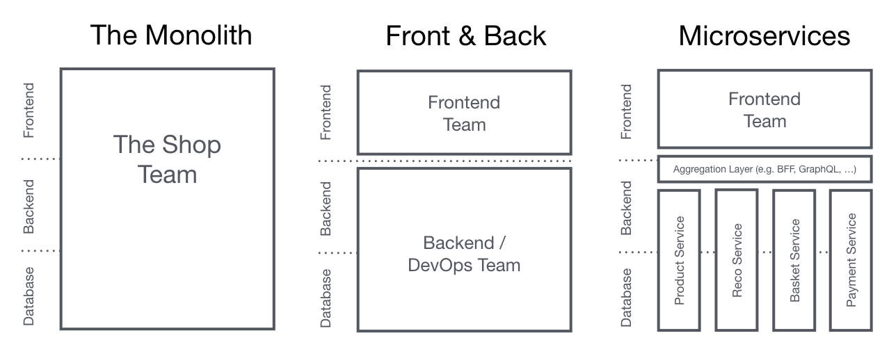
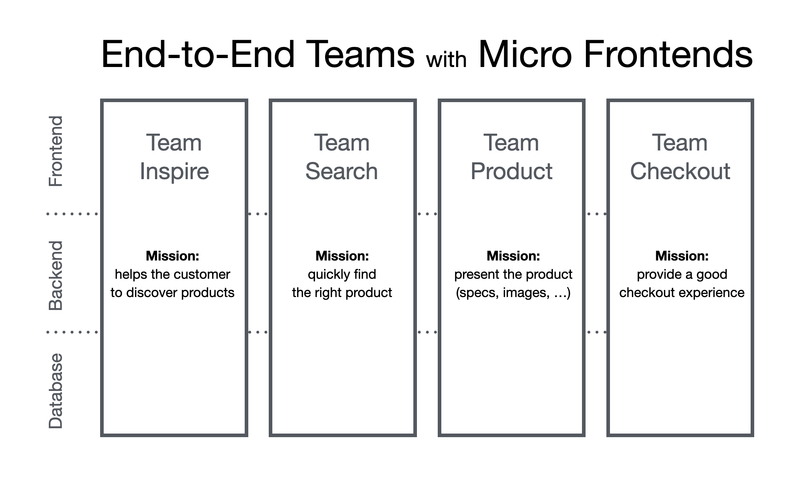

Birden fazla ekiple, özellikleri bağımsız olarak yayınlayabilen __modern bir web uygulaması__ oluşturmak için teknikler, stratejiler ve yöntemler.

## Mikro Frontend'ler nedir?

__Mikro Frontend__ terimi ilk olarak 2016'nın sonunda [ThoughtWorks Technology Radar](https://www.thoughtworks.com/radar/techniques/micro-frontends)'da ortaya çıktı. Mikro frontend, mikro servis kavramlarını frontend dünyasına taşır. Güncel eğilim, mikro servis mimarisinin üzerinde çalışan, zengin özellikli ve güçlü bir tarayıcı uygulaması (single page application - tek sayfa uygulaması) inşa etmektir. Zamanla, çoğunlukla ayrı bir ekip tarafından geliştirilen frontend katmanı büyür ve bakım maliyeti artar. Buna [Frontend Monolit](https://www.youtube.com/watch?v=pU1gXA0rfwc) diyoruz.

Micro Frontends fikrinin arkasındaki temel düşünce, bir web sitesi veya web uygulamasını, __bağımsız ekiplerin__ sahip olduğu __özelliklerin bir bileşimi__ olarak görmektir. Her ekip, __kendi sorumlu olduğu iş alanına__ veya __hedefine__ odaklanır ve bu konuda uzmanlaşır. Bu ekipler __çapraz fonksiyonel__ (farklı rolleri barındıran ekip yapısı) yapıya sahiptir ve  __uçtan uca (end-to-end)__ çalışırlar; yani bir özelliği veritabanından kullanıcı arayüzüne kadar kendileri geliştirir.

Ancak bu fikir aslında yeni değil. [Self-contained Systems](http://scs-architecture.org/) kavramıyla pek çok ortak noktası vardır. Geçmişte buna benzer yaklaşımlar [Dikeyleştirilmiş Sistemler için Frontend Entegrasyonu (Frontend Integration for Verticalised Systems)](https://www.otto.de/jobs/en/technology/techblog/blogpost/architecture-principles-2013-04-15.php) adıyla anılıyordu. Ancak Micro Frontends terimi, bu kavramı anlatmak için daha sade ve anlaşılır bir isimdir.

__Monolitik Frontend'ler__

__Dikey Organizasyon__

## Modern bir Web Uygulaması nedir?

Giriş kısmında “modern bir web uygulaması geliştirmek” ifadesini kullanmıştım. Şimdi bu ifadenin arkasındaki varsayımları netleştirelim.

Daha geniş bir bakış açısından bakarsak, [Aral Balkan](https://ar.al/) [“Documents-to-Applications Continuum” (Dokümanlardan Uygulamalara Süreklilik)](https://ar.al/notes/the-documents-to-applications-continuum/) adını verdiği bir kavram hakkında bir blog yazısı yazmıştır. Bu kavramda, bir ucunda (__sol tarafta__) bağlantılarla birbirine bağlanmış __statik sayfalardan__ oluşan bir web sitesi, diğer ucunda ise (__sağ tarafta__) tamamen etkileşime dayalı, __içerikten ziyade__ davranış odaklı bir uygulama (örneğin bir online fotoğraf düzenleyici) bulunur.

Eğer projeniz bu ölçeğin __sol tarafına__, yani “doküman ağırlıklı” tarafa yakınsa, __web sunucusu seviyesinde entegrasyon__ uygun bir yaklaşımdır. Bu modelde sunucu, kullanıcının talep ettiği sayfayı oluşturmak için farklı bileşenlerden gelen __HTML çıktısını birleştirir__. Güncellemeler sayfanın yeniden yüklenmesiyle veya AJAX istekleriyle belirli bölümlerin yenilenmesiyle yapılır. Bu konuda [Gustaf Nilsson Kotte](https://twitter.com/gustaf_nk/) oldukça [kapsamlı bir makale](https://gustafnk.github.io/microservice-websites/) yazmıştır.

Ancak kullanıcı arayüzünüzün __anında geri bildirim__ vermesi gerekiyorsa —özellikle bağlantının zayıf veya kesintili olduğu durumlarda— yalnızca sunucu tarafında render edilen bir site yeterli olmaz. [Optimistic UI](https://www.smashingmagazine.com/2016/11/true-lies-of-optimistic-user-interfaces/) veya [Skeleton Screens](http://www.lukew.com/ff/entry.asp?1797) gibi teknikleri uygulayabilmek için arayüzü doğrudan __cihaz üzerinde güncelleyebilmeniz__ gerekir. Google’ın  [“Progressive Web Apps” kavramı](https://developers.google.com/web/progressive-web-apps/), bu __dengeyi__ çok iyi özetler: Hem web’in temel ilkelerine sadık kalmak (progressive enhancement) hem de uygulama benzeri bir performans sunmak. Bu tür uygulamalar, __site-uygulama ölçeğinin ortalarına denk gelir__. Bu noktada yalnızca sunucu tabanlı çözümler yeterli olmaz — __entegrasyonu tarayıcıya taşımamız__ gerekir ve bu makalenin odak noktası da tam olarak budur.

## Mikro Frontend'lerin Arkasındaki Temel Fikirler

* __Teknoloji Bakımından Bağımsız Olun__ Her ekip, diğer ekiplerle koordine olmak zorunda kalmadan kendi teknolojik yığınını seçebilmeli ve güncelleyebilmelidir. [Custom Elements](#the-dom-is-the-api), diğerlerine tarafsız bir arayüz sunarken uygulama detaylarını gizlemek için harika bir yöntemdir.
* __Ekip Kodunu İzole Edin__ Tüm ekipler aynı framework'ü kullansa bile aynı çalışma zamanını paylaşmayın. Kendi içinde yeterli, bağımsız uygulamalar inşa edin. Paylaşılan duruma veya global değişkenlere güvenmeyin.
* __Ekip Önekleri Belirleyin__ İzolasyonun henüz mümkün olmadığı yerlerde isimlendirme kuralları üzerinde anlaşın. Çakışmaları önlemek ve sahipliği netleştirmek için CSS, Event'ler, Local Storage ve Cookie'ler için isim alanları kullanın.
* __Özel API'ler Yerine Yerel Tarayıcı Özelliklerini Tercih Edin__ Küresel bir PubSub sistemi kurmak yerine [iletişim için Tarayıcı Event'lerini](#parent-child-communication--dom-modification) kullanın. Ekipler arası bir API kurmanız gerçekten gerekiyorsa, mümkün olduğunca basit tutmaya çalışın.
* __Dayanıklı Bir Site İnşa Edin__ JavaScript başarısız olsa ya da henüz çalışmamış olsa bile özelliğiniz faydalı olmalı. Algılanan performansı artırmak için [Evrensel Render](#server-side-rendering--universal-rendering) ve Kademeli İyileştirme'yi kullanın.

---

## DOM, API'dir

[Custom Elements](https://developers.google.com/web/fundamentals/getting-started/primers/customelements), Web Components standardındaki tarayıcıların birlikte çalışmasını sağlayan kısımdır ve tarayıcı içinde entegrasyon yapmak için iyi bir temel sağlar. Her ekip, __seçtiği web teknolojisini kullanarak__ bileşenini oluşturur ve onu __bir Custom Element içine sarar__ (ör. `<order-minicart></order-minicart>`). Bu özel elementin DOM spesifikasyonu (etiket adı, attributelar ve event'ler) diğer ekipler için bir sözleşme ya da genel API görevi görür. Avantajı, diğer ekiplerin uygulama ayrıntılarını bilmeden bileşeni ve işlevlerini kullanabilmesidir. Yalnızca DOM ile etkileşime girebilmeleri yeterlidir.

Ancak sadece Custom Elements kullanmak, tüm ihtiyaçlarımızı karşılamaz. Sayfanın kademeli olarak yüklenmesi (progressive enhancement), sunucu tarafında da çalışması (universal rendering) veya sayfa yönlendirmeleri (routing) gibi şeyler için ek yazılımlara ihtiyacımız vardır.

Bu sayfa iki ana bölüme ayrılmıştır. Önce [Sayfa Bileşimi](#page-composition) — farklı ekiplerin sahip olduğu bileşenlerden bir sayfanın nasıl oluşturulacağını — tartışacağız. Ardından istemci tarafında [Sayfa Geçişleri](#navigating-between-pages) uygulamasına dair örnekler göstereceğiz.

## Sayfa Bileşimi

__Farklı framework'lerle__ yazılmış kodun __istemci__ ve __sunucu__ tarafında entegrasyonunun yanı sıra, ele alınması gereken birçok yan konu vardır: js'i __izole etme__ mekanizmaları, __css çakışmalarını önleme__, gerektikçe __kaynak yükleme__, ekipler arasında __ortak kaynakları paylaşma__, __veri alma__ süreçlerini yönetme ve kullanıcı için iyi __yükleme durumları__ tasarlama. Bu konuları adım adım ele alacağız.

### Temel Prototip

Bu model traktör mağazasının ürün sayfası, aşağıdaki örnekler için temel alınacaktır.

Sayfada, üç farklı traktör modeli arasında geçiş yapmamızı sağlayan bir __model seçici (variant selector)__ bulunur. Model değiştirildiğinde, ürün resmi, adı, fiyatı ve önerilen ürünler buna göre güncellenir. Ayrıca bir __“Satın Al (Buy)” butonu__ vardır. Bu butona basıldığında seçilen model sepete eklenir. Sayfanın üst kısmındaki __mini sepet (mini basket)__ de buna göre güncellenir.

[tarayıcıda dene](./0-model-store/) & [kodu incele](https://github.com/neuland/micro-frontends/tree/master/0-model-store)

Tüm HTML, __yalnızca JavaScript kullanılarak (yani ek bir kütüphane olmadan)__ istemci tarafında oluşturuluyor. Kodda ES6’nın Template String yapısı kullanılmış ve __hiçbir bağımlılık (no dependencies)__ eklenmemiştir. Uygulama, durum (state) ve HTML yapısı (markup) arasında basit bir ayrım yapar. Herhangi bir değişiklik olduğunda, sayfadaki tüm HTML yeniden oluşturulur. Yani şu anda gelişmiş bir DOM fark hesaplama (DOM diffing) veya __sunucu tarafı render (universal rendering)__ kullanılmıyor. Ayrıca bu örnekte ekip ayrımı da yok [tüm kod](https://github.com/neuland/micro-frontends/tree/master/0-model-store) tek bir js ve css dosyasında yazılmış.

### İstemci Tarafı Entegrasyon

Bu örnekte sayfa, üç ekibin sahip olduğu ayrı bileşenlere/parçalara ayrılır. __Team Checkout__ (mavi), satın alma süreciyle ilgili her şeyden — yani __satın alma butonu__ ve __mini sepetten__ — sorumludur. __Team Inspire__ (yeşil) bu sayfadaki __ürün önerilerini__ yönetir. Sayfanın kendisi ise __Team Product__'a (kırmızı) aittir.

[tarayıcıda dene](./1-composition-client-only/) & [kodu incele](https://github.com/neuland/micro-frontends/tree/master/1-composition-client-only)

__Team Product__, hangi işlevlerin dahil edileceğine ve yerleşimde nereye konumlanacağına karar verir. Sayfa, ürün adı, görseli ve mevcut varyantlar gibi Team Product tarafından sağlanabilecek bilgileri içerir. Ancak diğer ekiplerden gelen parçaları (Custom Element'ler) da içerir.

### Bir Custom Element Nasıl Oluşturulur?

__Satın Al (Buy) butonunu__ bir örnek olarak ele alalım. Team Product, bu butonu sayfada istediği yere eklemek için sadece şunu yazar: `<blue-buy sku="t_porsche"></blue-buy>`. Ancak bu butonun gerçekten çalışabilmesi için, Team Checkout sayfada `blue-buy` adlı bu elementi kaydetmek (register etmek) zorundadır.

    class BlueBuy extends HTMLElement {
      connectedCallback() {
        this.attachShadow({ mode: 'open' });
        this.shadowRoot = `<button type="button">buy for 66,00 €</button>`;
      }

      disconnectedCallback() { ... }
    }
    window.customElements.define('blue-buy', BlueBuy);

Artık tarayıcı her yeni `blue-buy` etiketiyle karşılaştığında `connectedCallback` çağrılır. `this`, custom elementin kök DOM düğümüne referanstır. `innerHTML` veya `getAttribute()` gibi standart bir DOM elementinin tüm özellik ve metotları kullanılabilir.

Bir custom element (özel HTML etiketi) oluştururken, standartlara (spesifikasyona) göre tek zorunlu kural, etiket adında mutlaka __bir tire (-)__ bulunmasıdır. Bunun nedeni, gelecekte eklenecek yeni HTML etiketleriyle çakışmayı önlemektir. Aşağıdaki örneklerde şu isimlendirme kuralı kullanılmıştır: `[team_color]-[feature]`. Bu kuralda team_color (örneğin “blue” veya “red”) ekibin adını veya kimliğini temsil eder, feature ise o ekibin geliştirdiği özelliği belirtir.

### Ebeveyn-Çocuk (Parent-Child) İletişimi / DOM Değişikliği

Kullanıcı __varyant seçicide__ başka bir traktör seçtiğinde, __satın alma butonunun__ buna göre __güncellenmesi__ gerekir. Bunu sağlamak için Team Product mevcut elementi DOM'dan __kaldırıp__ yerine __yenisini ekleyebilir__.

    container.innerHTML;
    // => <blue-buy sku="t_porsche">...</blue-buy>
    container.innerHTML = '<blue-buy sku="t_fendt"></blue-buy>';

Eski element (bileşen) sayfadan kaldırıldığında, onun `disconnectedCallback` fonksiyonu hemen (senkron olarak) çalıştırılır. Bu sayede element, olay dinleyicileri (event listener’lar) gibi şeyleri temizleme fırsatı bulur. Ardından, yeni oluşturulan `t_fendt` elementinin `connectedCallback` fonksiyonu çağrılır.

Daha performanslı bir seçenek ise mevcut element üzerindeki `sku` attributunu güncellemektir.

    document.querySelector('blue-buy').setAttribute('sku', 't_fendt');

Team Product, React gibi DOM farklarını (DOM diffing) otomatik olarak yöneten bir şablon motoru (templating engine) kullansaydı, bu işlemler (yani eski elementin silinip yenisinin eklenmesi) otomatik olarak algoritma tarafından yapılırdı.

Bunu desteklemek için (yani elementin attribute’larındaki değişiklikleri fark edebilmek için), Custom Element içinde `attributeChangedCallback` fonksiyonu tanımlanabilir. Ayrıca hangi attribute’ların değiştiğinde bu fonksiyonun tetikleneceğini belirtmek için bir `observedAttributes` listesi oluşturulur.

    const prices = {
      t_porsche: '66,00 €',
      t_fendt: '54,00 €',
      t_eicher: '58,00 €',
    };

    class BlueBuy extends HTMLElement {
      static get observedAttributes() {
        return ['sku'];
      }
      connectedCallback() {
        this.render();
      }
      render() {
        if (!this.shadowRoot) {
          this.attachShadow({ mode: 'open' });
        }
        const sku = this.getAttribute('sku');
        const price = prices[sku];
        this.shadowRoot.innerHTML = `<button type="button">buy for ${price}</button>`;
      }
      attributeChangedCallback(attr, oldValue, newValue) {
        this.render();
      }
      disconnectedCallback() {...}
    }
    window.customElements.define('blue-buy', BlueBuy);

Tekrardan kaçınmak için, bir render() metodu eklenmiştir. Bu metod hem `connectedCallback` içinde hem de `attributeChangedCallback` içinde çağrılır. `render()` metodu, gerekli verileri toplar ve `innerHTML` kullanarak yeni HTML içeriğini sayfaya yazar. Eğer ileride Custom Element içinde daha gelişmiş bir şablon motoru (templating engine) veya framework (örneğin React, Vue, Lit vb.) kullanılmasına karar verilirse, bu render() metodu — yani bu nokta — o araçların başlatma (initialization) kodunun yazılacağı yerdir.

### Tarayıcı Desteği

Yukarıdaki örnek, Custom Element standardını (Custom Element Spec) kullanmaktadır. Bu standart, [tüm modern tarayıcılar tarafından desteklenmektedir](http://caniuse.com/#feat=custom-elementsv1). Bu yüzden ek bir polyfill (tarayıcı desteği olmayan özellikleri taklit eden ek kod) ya da hack kullanmaya gerek yoktur. Aynı şey Shadow DOM için de geçerlidir. [Shadow DOM](https://caniuse.com/shadowdomv1), bir Custom Element’in HTML yapısını ve stillerini (CSS) dış dünyadan izole etmek (kapsüllemek) için kullanılır.

### Framework Uyumluluğu

Custom Element'ler bir web standardı olduğu için React, Vue, Angular, Svelte ve Preact gibi tüm başlıca JavaScript framework'leri tarafından desteklenir.
Uygulamanıza bir Custom Element'i yerel bir HTML etiketi gibi gömmenize olanak tanırlar; ayrıca framework'e özgü uygulamanızı bir Custom Element olarak yayımlamanız için yollar sunarlar.

### Framework Anarşisinden Kaçının

Custom Elements kullanmak, farklı ekiplerin geliştirdiği sayfa parçaları (fragmentler) arasında yüksek düzeyde bağımsızlık (decoupling) sağlamanın harika bir yoludur. Bu sayede her ekip, kendi istediği frontend framework’ünü (örneğin React, Vue, Angular vb.) seçip kullanabilir. Ancak şunu unutmamak gerekir: Bir şeyi yapabiliyor olman, onu yapmanın doğru olduğu anlamına gelmez. Farklı teknolojileri rastgele karıştırmak (“[Micro Frontends Anarchy](https://www.thoughtworks.com/radar/techniques/micro-frontend-anarchy)”) iyi bir fikir değildir.
Bunun yerine, ekipler arasında belirli bir uyum (alignment) sağlamak gerekir. Böylece ekipler birbirleriyle öğrenimlerini ve en iyi uygulamalarını paylaşabilir. Ayrıca merkezi bir pattern kütüphanesi kurmak istediğinizde işiniz kolaylaşmış olur. Bununla birlikte, teknolojileri karıştırabilme yeteneği; eski bir uygulamayla çalışırken ve yeni bir teknoloji yığınına geçiş yapmak istediğinizde kullanışlı olabilir.

### Çocuk-Ebeveyn (Parent-Child) veya Kardeş (Sibling) İletişimi / DOM Olayları

Ancak attributeları aşağı doğru iletmek tüm etkileşimler için yeterli değildir. Bizim örneğimizde kullanıcı __satın alma butonuna tıkladığında__ __mini sepetin yenilenmesi__ gerekir.

Her iki parça da Team Checkout ekibine ait olduğu için, ekip bu parçalar arasında iletişim kurmak adına kendi içlerinde bir JavaScript API oluşturabilir. Bu API sayesinde, “mini basket” bileşeni, satın alma butonuna basıldığını öğrenebilir. Ancak bu yaklaşımın bir sakıncası var: Bileşenlerin birbirinin varlığını bilmesi gerekir (yani direkt olarak birbirlerine bağlı olurlar). Bu da bileşenler arasındaki bağımsızlığı (izolasyonu) bozarak, ayrık yapı ilkesine aykırı olur.

Daha temiz ve doğru bir yöntem, bileşenler arası iletişim için Pub/Sub (Publish–Subscribe) yapısını kullanmaktır. Bu yapıda: Bir bileşen bir mesaj yayınlar (publish), Diğer bileşenler ise istedikleri mesajlara abone (subscribe) olabilir. Neyse ki tarayıcılar bu özelliği zaten doğal olarak destekler. Çünkü tarayıcıdaki `click`, `select` veya `mouseover` gibi olaylar da aynı mantıkla çalışır. Bunlara ek olarak, sadece bu yerleşik (native) olayları kullanmak zorunda değiliz `new CustomEvent(...)` ile kendi özel olaylarımızı da tanımlayabiliriz. Olaylar (Events) her zaman hangi DOM elemanı üzerinde oluşturulduysa veya tetiklendiyse (dispatch edildiyse) ona bağlıdır. Birçok yerleşik olayda olduğu gibi, bu olaylar bubbling (yukarı doğru baloncuklanma) özelliğine de sahip olabilir. Bu sayede: Belirli bir DOM alanı içinde gerçekleşen tüm olaylar üst elemanlardan dinlenebilir. Sayfanın tamamındaki olayları dinlemek istiyorsan, dinleyiciyi window nesnesine bağlaman yeterlidir. Örnekte, blue:basket:changed isimli özel bir event oluşturma işlemi aşağıdaki gibi yapılmıştır:

    class BlueBuy extends HTMLElement {
      [...]
      connectedCallback() {
        [...]
        this.render();
        this.shadowRoot.querySelector('button').addEventListener('click', this.addToCart);
      }
      addToCart() {
        // maybe talk to an api
        this.dispatchEvent(new CustomEvent('blue:basket:changed', {
          bubbles: true,
        }));
      }
      render() {
        if (!this.shadowRoot) {
          this.attachShadow({ mode: 'open' });
        }
        this.shadowRoot.innerHTML = `<button type="button">buy</button>`;
      }
      disconnectedCallback() {
        this.shadowRoot.querySelector('button').removeEventListener('click', this.addToCart);
      }
    }

Mini sepet artık bu olaya `window` üzerinde abone olabilir ve verilerini yenilemesi gerektiğinde bilgilendirilir.

    class BlueBasket extends HTMLElement {
      connectedCallback() {
        [...]
        window.addEventListener('blue:basket:changed', this.refresh);
      }
      refresh() {
        // fetch new data and render it
      }
      disconnectedCallback() {
        window.removeEventListener('blue:basket:changed', this.refresh);
      }
    }

Bu yaklaşımda mini sepet bileşeni (mini basket), kendi kapsamının dışındaki bir DOM elementine, yani (`window`)'a bir olay dinleyici (event listener) ekler. Bu çoğu uygulama için sorun değildir ve rahatlıkla kullanılabilir. Ancak eğer bu durum uygun değilse, şu şekildeki alternatif de kullanılabilir: Sayfanın kendisi (Team Product) bu olayı dinler. Olay gerçekleştiğinde, sayfa mini sepet bileşenini bulur ve onun üzerinde `refresh()` metodunu çağırarak güncelleme yapmasını sağlar. Bu şekilde mini sepet bileşeni doğrudan window ile iletişime geçmek zorunda kalmaz.

// page.js
const $ = document.getElementsByTagName;

$('blue-buy')[0].addEventListener('blue:basket:changed', function() {
  $('blue-basket')[0].refresh();
});

DOM metotlarını doğrudan (imperative şekilde) çağırmak çok sık kullanılan bir yöntem değildir. Ama örneğin [video element API](https://developer.mozilla.org/en-US/docs/Web/API/HTMLMediaElement#methods)’sinde bu tarz kullanımlara rastlayabilirsiniz. Eğer mümkünse, bunun yerine deklaratif yaklaşım (yani attribute’ların değiştirilmesiyle işlem yapılması) tercih edilmelidir.

## Sunucu Tarafı Render / Evrensel Render

Custom Elements, tarayıcı içinde bileşenleri entegre etmek için harika bir yöntemdir. Ancak internete açık bir web sitesi geliştiriyorsanız, ilk yükleme performansı çok önemlidir. Çünkü tüm JavaScript framework’leri indirilip çalıştırılana kadar kullanıcılar büyük ihtimalle beyaz bir ekran görecektir. Ayrıca, JavaScript’in hata vermesi veya tarayıcı tarafından engellenmesi durumunda sitenin ne yapacağı da düşünülmelidir. [Jeremy Keith](https://adactio.com/), [Resilient Web Design](https://resilientwebdesign.com/) adlı ebook/podcast’inde bu konunun önemini çok iyi açıklıyor. Bu yüzden, sitenin temel içeriklerinin sunucu tarafında render edilebilmesi çok kritik bir ihtiyaçtır. Ne yazık ki, Web Components standartlarında sunucu tarafında render ile ilgili hiçbir şey yok. JavaScript yoksa, Custom Elements da yok :(

### Custom Elements + Server Side Includes = ❤️

Sunucu tarafında render işlemini mümkün hale getirmek için, önceki örnek yeniden düzenlenmiştir. Artık her takımın kendi Express server’ı vardır ve Custom Element’in `render()` metodu da bir URL üzerinden erişilebilir hale getirilmiştir.

    $ curl http://127.0.0.1:3000/blue-buy?sku=t_porsche
    <button type="button">buy for 66,00 €</button>

Custom Element’in etiket adı, sunucudaki URL yolu (path) olarak kullanılır — atribütler (attributes) ise query parametrelerine dönüştürülür. Bu sayede, her bileşenin içeriğini sunucu tarafında render etmek mümkün hale gelir. Bunu `<blue-buy>` Custom Element’i ile birleştirdiğimizde, ortaya __evrensel (universal) bir Web Component__’e oldukça yakın bir yapı çıkmış olur:

    <blue-buy sku="t_porsche">
      <!--#include virtual="/blue-buy?sku=t_porsche" -->
    </blue-buy>

`#include` yorum satırı, çoğu web sunucusunda bulunan bir özellik olan [Server Side Includes](https://en.wikipedia.org/wiki/Server_Side_Includes)'in bir parçasıdır. Evet, zamanında sitelerimize güncel tarihi gömmek için kullandığımız tekniğin aynısı. [ESI](https://en.wikipedia.org/wiki/Edge_Side_Includes), [nodesi](https://github.com/Schibsted-Tech-Polska/nodesi), [compoxure](https://github.com/tes/compoxure) ve [tailor](https://github.com/zalando/tailor) gibi alternatif teknikler de vardır; ancak projelerimizde SSI kendini basit ve son derece stabil bir çözüm olarak kanıtlamıştır.

`#include` yorum satırı, tarayıcıya sayfanın tamamı gönderilmeden önce, `/blue-buy?sku=t_porsche` isteğinden gelen cevap ile değiştirilir. Yani sunucu, HTML’i kullanıcıya göndermeden önce bu kısmı dinamik olarak doldurur. Bu işlemin nginx üzerindeki yapılandırması (config) aşağıdaki gibi görünür:

    upstream team_blue {
      server team_blue:3001;
    }
    upstream team_green {
      server team_green:3002;
    }
    upstream team_red {
      server team_red:3003;
    }

    server {
      listen 3000;
      ssi on;

      location /blue {
        proxy_pass  http://team_blue;
      }
      location /green {
        proxy_pass  http://team_green;
      }
      location /red {
        proxy_pass  http://team_red;
      }
      location / {
        proxy_pass  http://team_red;
      }
    }

`ssi: on;` yönergesi SSI özelliğini etkinleştirir ve her ekip için birer `upstream` ve `location` bloğu eklenir; böylece `/blue` ile başlayan tüm url'ler doğru uygulamaya (`team_blue:3001`) yönlendirilir. Ayrıca ana sayfayı / ürün sayfasını kontrol eden kırmızı ekibe `/` rotası eşlenir.

Bu animasyon, __JavaScript'in devre dışı__ olduğu bir tarayıcıda traktör mağazasını gösterir.

[kodu incele](https://github.com/neuland/micro-frontends/tree/master/2-composition-universal)

Artık variant seçim butonları gerçek linkler haline gelmiş durumda ve her tıklama, sayfanın yeniden yüklenmesine neden oluyor. Sağdaki terminal, bir sayfa isteğinin nasıl Team Red’e yönlendirildiğini gösteriyor. Team Red, ürün sayfasını kontrol ediyor ve ardından sayfa işaretlemesi (markup) Team Blue ve Team Green’in parçalarıyla tamamlanıyor.

JavaScript’i tekrar açtığınızda, yalnızca ilk isteğe ait sunucu logları görünecektir. Tüm sonraki traktör değişiklikleri, tıpkı ilk örnekte olduğu gibi istemci tarafında (client-side) işlenir. Daha sonraki bir örnekte ise, ürün verileri JavaScript’ten alınacak ve gerektiğinde bir REST API aracılığıyla yüklenecektir.

Bu örnek kodu yerel makinenizde deneyebilirsiniz. Yalnızca [Docker Compose](https://docs.docker.com/compose/install/) kurulu olmalıdır.

    git clone https://github.com/neuland/micro-frontends.git
    cd micro-frontends/2-composition-universal
    docker-compose up --build

Docker daha sonra 3000 portunda nginx'i başlatır ve her ekip için node.js imajını oluşturur. Tarayıcınızda [http://127.0.0.1:3000/](http://127.0.0.1:3000/) adresini açtığınızda kırmızı bir traktör görmelisiniz. `docker-compose`'un birleştirilmiş günlüğü, ağda neler olduğunu görmeyi kolaylaştırır. Ne yazık ki çıktı rengini kontrol etmenin bir yolu yok; bu yüzden mavi ekibin yeşil renkle vurgulanmış olmasına katlanmanız gerekecek :)

`src` dosyaları her bir container içine eşlenir ve kodda bir değişiklik yaptığınızda Node uygulaması otomatik olarak yeniden başlatılır. Ancak `nginx.conf` dosyasını değiştirmek istiyorsanız, değişikliğin geçerli olması için `docker-compose`’u yeniden başlatmanız gerekir. Yani, rahatça denemeler yapabilir ve geri bildirim verebilirsiniz.

### Veri Alma & Yükleme Durumları

SSI/ESI yaklaşımının bir dezavantajı, __en yavaş parçanın (fragment) tüm sayfanın yanıt süresini belirlemesidir__. Bu yüzden, bir parçanın yanıtının önbelleğe alınabilmesi iyi olur. Üretmesi pahalı ve önbelleğe almak zor olan parçalar için, genellikle ilk render sırasında dahil edilmemeleri iyi bir fikirdir. Bu parçalar daha sonra tarayıcıda asenkron olarak yüklenebilir. Bizim örneğimizde, `green-recos` fragmenti (kişiselleştirilmiş önerileri gösteren kısım) bunun için uygun bir adaydır. 

Bir çözüm olarak, Team Red sadece SSI Include’ı atlayabilir.

**Önce**

    <green-recos sku="t_porsche">
      <!--#include virtual="/green-recos?sku=t_porsche" -->
    </green-recos>

**Sonra**

    <green-recos sku="t_porsche"></green-recos>

*Önemli not: Custom Element'ler [self-closing olamaz](https://developers.google.com/web/fundamentals/web-components/customelements); dolayısıyla `<green-recos sku="t_porsche" />` yazmak doğru çalışmayacaktır.*

Render işlemi sadece tarayıcıda gerçekleşir. Ancak animasyonda görüldüğü gibi, bu değişiklik sayfada __önemli bir yeniden akış (reflow)__ oluşturmuştur. Öneri alanı başlangıçta boşdur. Team Green’in JavaScript’i yüklenir ve çalıştırılır. Kişiselleştirilmiş önerileri almak için API çağrısı yapılır. Öneri işaretlemesi (markup) render edilir ve ilgili resimler istenir. Bu fragment artık daha fazla alan gerektirir ve sayfanın düzeni (layout) etkilenir.

Böyle can sıkıcı bir reflow’dan kaçınmak için farklı seçenekler vardır. Sayfayı kontrol eden Team Red, __öneri kutularının (recommendation containers) yüksekliğini sabitleyebilir__. Ancak responsive bir sitede yüksekliği belirlemek genellikle zordur, çünkü farklı ekran boyutlarında değişebilir. Daha önemli bir konu ise, __bu tür bir takımlar arası anlaşma, Team Red ve Team Green arasında sıkı bir bağımlılık (tight coupling) oluşturur__. Örneğin, Team Green reco element’ine ek bir alt başlık eklemek isterse, yeni yüksekliği belirlemek için Team Red ile koordinasyon yapması gerekir. Her iki takım da sayfa düzeninin bozulmaması için değişikliklerini eş zamanlı olarak uygulamak zorundadır.

Bunun daha iyi bir yolu, [Skeleton Screens](https://blog.prototypr.io/luke-wroblewski-introduced-skeleton-screens-in-2013-through-his-work-on-the-polar-app-later-fd1d32a6a8e7) adı verilen tekniği kullanmaktır. Bu yöntemde: Team Red, `green-recos` için olan SSI Include satırını HTML içinde bırakır. Team Green ise kendi fragment’ının __sunucu tarafı render__ yöntemini değiştirir ve gerçek içerik yerine, __içeriğin şematik (iskelet) bir versiyonunu__ üretir. Bu __skeleton (iskelet) görünüm__, gerçek içeriğin bazı layout (yerleşim) stillerini kullanabilir. Böylece sayfada __ihtiyaç duyulan alan baştan ayrılır__ ve gerçek içerik geldiğinde sayfa düzeni zıplamaz veya kaymaz.

Skeleton ekranlar (Skeleton Screens) sadece sunucu tarafı için değil, __istemci tarafı (client-side) render__ için de __çok kullanışlıdır__. Bir kullanıcı etkileşimi sonucunda Custom Element DOM’a eklendiğinde, sunucudan gerekli veriler gelene kadar __hemen skeleton (iskelet) görünümü__ gösterebilir. Böylece kullanıcı boş bir alan yerine, içeriğin yüklenmekte olduğunu anlayabileceği bir taslak görür.

Varyant seçimi gibi bir __attribute değiştiğinde__ bile, yeni veri gelene kadar bileşeni skeleton görünüme geçirmeyi tercih edebilirsiniz. Bu sayede kullanıcı, o bölümde bir işlem olduğunu fark eder. Ancak dikkat edilmesi gereken bir nokta var: Eğer sunucudan gelen cevap çok hızlıysa, eski veri ile yeni veri arasında çok kısa bir __skeleton yanıp sönmesi (flicker)__ oluşabilir ve bu da kullanıcıyı rahatsız edebilir. Bu durumda: Eski veriyi korumak, Ya da akıllı zaman aşımı (timeout) kullanmak gibi yöntemler yardımcı olabilir. Yani bu tekniği dikkatli kullanın ve mümkünse kullanıcı geri bildirimi alın.

## Daha Fazla Örneğe mi İhtiyacınız Var?

[Tractor Store 2.0'a göz atın](/tractor-store/)

Bu, __yönlendirme ve gezinme__, __iletişim__, __durum yönetimi__, __yükleme stratejileri__, __kod paylaşımı__, __varlık optimizasyonları__ ve __test__ gibi zorlukları içeren daha gerçek-dünya bir micro frontends örneğidir. Bu site, aynı uygulamanın farklı teknolojilerle geliştirilmiş versiyonlarının bir arada bulunduğu bir örnek projedir. Bunu Micro Frontend’ler için yapılmış bir [TodoMVC](http://todomvc.com/) gibi düşünebilirsiniz.

## Ek Kaynaklar
- [Kitap: Micro Frontends in Action](https://www.manning.com/books/micro-frontends-in-action?a_aid=mfia&a_bid=5f09fdeb) Tarafımdan yazıldı.
- [Konuşma: Micro Frontends - MicroCPH, Kopenhag 2019](https://www.youtube.com/watch?v=wCHYILvM7kU) ([Slaytlar](https://noti.st/naltatis/zQb2m5/micro-frontends-the-nitty-gritty-details-or-frontend-backend-happyend)) The Nitty Gritty Details or Frontend, Backend, 🌈 Happyend
- [Konuşma: Micro Frontends - Web Rebels, Oslo 2018](https://www.youtube.com/watch?v=dTW7eJsIHDg) ([Slaytlar](https://noti.st/naltatis/HxcUfZ/micro-frontends-think-smaller-avoid-the-monolith-love-the-backend)) Think Smaller, Avoid the Monolith, ❤️the Backend
- [Slaytlar: Micro Frontends - JSUnconf.eu 2017](https://speakerdeck.com/naltatis/micro-frontends-building-a-modern-webapp-with-multiple-teams)
- [Konuşma: Break Up With Your Frontend Monolith - JS Kongress 2017](https://www.youtube.com/watch?v=W3_8sxUurzA) Elisabeth Engel, gutefrage.net'te Micro Frontends uygulamasını anlatıyor
- [Makale: Micro Frontends](https://martinfowler.com/articles/micro-frontends.html) Cam Jackson'dan Martin Fowler'ın blogunda bir makale
- [Yazı: Micro frontends - front-end web geliştirmeye mikro servis yaklaşımı](https://medium.com/@tomsoderlund/micro-frontends-a-microservice-approach-to-front-end-web-development-f325ebdadc16) Tom Söderlund temel konsepti açıklar ve bağlantılar sunar
- [Yazı: Microservices to Micro-Frontends](http://www.agilechamps.com/microservices-to-micro-frontends/) Sandeep Jain mikro servisler ve micro frontendlerin temel ilkelerini özetler
- [Bağlantı Koleksiyonu: Elisabeth Engel'den Micro Frontends](https://micro-frontends.zeef.com/elisabeth.engel?ref=elisabeth.engel&share=ee53d51a914b4951ae5c94ece97642fc) bu konuya dair geniş bir yazı, konuşma, araç ve kaynak listesi
- [Awesome Micro Frontends](https://github.com/ChristianUlbrich/awesome-microfrontends) Christian Ulbrich tarafından derlenmiş bağlantılar listesi 🕶
- [Custom Elements Everywhere](https://custom-elements-everywhere.com/) Framework'lerin ve custom elementlerin uyumlu olmasını sağlar
- Traktörler [manufactum.com](https://www.manufactum.com/) üzerinden satın alınabilir :) _Bu mağaza burada açıklanan teknikleri kullanan iki ekip tarafından geliştirilmiştir._

## Katkıda Bulunanlar
- [Koike Takayuki](https://github.com/koiketakayuki) siteyi [Japonca](https://micro-frontends-japanese.org/)ya çevirdi.
- [Jorge Beltrán](https://github.com/scipion) siteyi [İspanyolca](https://micro-frontends-es.org)'ya çevirdi.
- [Bruno Carneiro](https://github.com/Tautorn) siteyi [Portekizce](https://tautorn.github.io/micro-frontends/)'ye çevirdi.
- [Soobin Bak](https://github.com/soobing) siteyi [Korece](https://soobing.github.io/micro-frontends/)'ye çevirdi.
- [Sergei Babin](https://github.com/serzn1) siteyi [Rusça](https://serzn1.github.io/micro-frontends/)'ya çevirdi.
- [Shiwei Yang](https://github.com/swearer23) siteyi [Çince](https://swearer23.github.io/micro-frontends/)'ye çevirdi.
- [Riccardo Moschetti](https://github.com/RiccardoGMoschetti) siteyi [İtalyanca](https://riccardogmoschetti.github.io/micro-frontends/)'ya çevirdi.
- [Dominik Czechowski](https://github.com/dominikcz) siteyi [Lehçe](https://dominikcz.github.io/micro-frontends/)'ye çevirdi.
- [John Adib](https://github.com/johnadib) siteyi [Farsça](https://johnadib.github.io/micro-frontends/)'ya çevirdi.
- [Mehmet Mutlu](https://github.com/MhmtMutlu) siteyi [Türkçe](https://MhmtMutlu.github.io/micro-frontends/)'ye çevirdi.

Bu site Github Pages tarafından oluşturulmuştur. Kaynağına [neuland/micro-frontends](https://github.com/neuland/micro-frontends/) üzerinden ulaşabilirsiniz.
